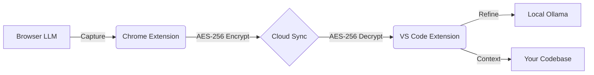

# 🧠 Synapse: The External Memory Layer for AI Developers

**Synapse** is a high-performance, zero-knowledge bridge between your Browser LLMs and your IDE. It captures technical decisions, architecture plans, and code snippets from your browser-based AI chats and makes them instantly available as grounded context in VS Code.

---

## 🚀 The Vision

Stop explaining your code twice. Synapse bridges the gap between the hours you spend architecting with Claude/ChatGPT and the minutes you spend implementing in VS Code. It’s not just a sync tool; it’s a persistent technical memory for your development workflow.

---

## 🛠️ Tech Stack

### Frontend & Integration
- **Chrome Extension (MV3)**: High-performance content injection and background processing.
- **VS Code Extension API**: Seamless sidebar integration and command-palette automation.
- **TypeScript & ESNext**: Type-safe logic and modern JS features.
- **esbuild**: Ultra-fast bundling and production-grade minification.

### Security & AI
- **AES-256 Encryption**: Local-first encryption (Crypto-JS) ensures your memory is zero-knowledge.
- **Transformers.js**: Local embedding generation for smart context retrieval.
- **Ollama Integration**: Connection to local LLMs for private technical summarization.

### Backend & Infrastructure
- **Supabase**: Robust PostgreSQL storage and real-time synchronization.
- **OAuth 2.0**: Secure authentication via Google and GitHub.

---

## ✨ Key Features

- **Universal Sync**: Works with **ChatGPT, Claude, Gemini, and DeepSeek**.
- **Context Injection**: One-click generation of `.md` memory files or raw context prompts.
- **Local AI Refinement**: Use Ollama to distill raw chat history into dense, actionable technical digests.
- **Zero-Knowledge**: Your encryption key never leaves your machine. Even we can't read your memories.

---

## 📦 Get Started

### VS Code Extension
Install the **Synapse Memory Bridge** directly from the Marketplace:
👉 [Download on VS Code Marketplace](https://marketplace.visualstudio.com/items?itemName=geervan.synapse-bridge)

### Chrome Extension
The web extension is currently in release phase. Stay tuned for the official Web Store link or manual installation guides.

---

## 🏗️ Architecture

---

## 🤝 Connect

Built by **Geervan**  
[LinkedIn](https://www.linkedin.com/in/geervan/) | [GitHub](https://github.com/Geervan)

---

> "Your AI shouldn't have amnesia. Bridge the gap with Synapse."
